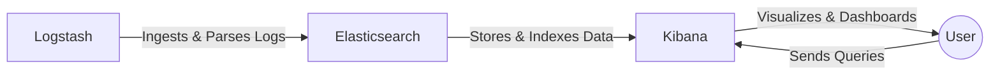

# 🚀 ELK Stack on Docker (Elasticsearch, Logstash, Kibana)


A ready-to-use **ELK stack** (Elasticsearch, Logstash, Kibana) configured with **Docker Compose**.


## 🏗️ Architecture

<details>
<summary><strong>Text Flow Diagram</strong> (click to expand)</summary>


</details>

## ✨ Features

- **Elasticsearch 8.15.1** with security enabled
- **Logstash 8.15.1** with email alerts for error logs
- **Kibana 8.15.1** for visualization
- Healthchecks and persistent storage
- Custom entrypoint script for Elasticsearch user setup

## 📦 Services Overview

| Service        | Port(s)                | Description                              |
| -------------- | ---------------------- | ---------------------------------------- |
| Elasticsearch  | `9200`                 | REST API for data storage and search     |
| Logstash       | `5044`, `5000`, `9600` | Data ingestion and transformation        |
| Kibana         | `5601`                 | Visualization and dashboard UI           |

## 🧰 Prerequisites

- [Docker](https://docs.docker.com/get-docker/)
- [Docker Compose](https://docs.docker.com/compose/install/)
- Gmail account or SMTP email service for Logstash alerts


## ⚙️ Setup Instructions

1. **Clone this repository:**
    ```bash
    git clone https://github.com/your-username/elk-docker.git
    cd elk-docker
    ```

2. **Project Files Explained:**
    - `docker-compose.yml` – Main Docker Compose configuration for ELK stack
    - `entrypoint.sh` – Custom Elasticsearch startup script (user setup)
    - `kibana.yml` – Custom Kibana configuration (security, connection)
    - `logstash.conf` – Logstash pipeline with error detection and email alerts

3. **Configure Email Alerts (Logstash):**
    - Edit `logstash.conf` and update the `email` output section with your SMTP credentials:
      ```properties
      username => "your_email@gmail.com"
      password => "<your_app_password>"
      from => "your_email@gmail.com"
      to => "destination_email@gmail.com"
      ```
    - Use an [App Password](https://support.google.com/accounts/answer/185833) if using Gmail.

4. **Start the Stack:**
    ```bash
    docker-compose up -d
    ```

5. **Access the Services:**
    - **Elasticsearch:** [http://localhost:9200](http://localhost:9200)
    - **Kibana:** [http://localhost:5601](http://localhost:5601)
    - **Logstash:** Ports `5044`, `5000`, `9600`


## 🗂️ File Details

### `docker-compose.yml`
* Defines all three services with healthchecks, persistent volumes, and environment variables.
* Mounts `entrypoint.sh` for Elasticsearch user setup.

### `entrypoint.sh`
* Starts Elasticsearch and waits for it to be ready.
* Adds a user for Kibana if not present.

### `kibana.yml`
* Sets up encryption keys and connects Kibana to Elasticsearch securely.

### `logstash.conf`
* Ingests logs via TCP (`5000`), tags error logs, and sends email alerts for errors.
* Forwards all logs to Elasticsearch and prints to stdout.


## 🛡️ Security Notes

- Default passwords and keys are for demo purposes. **Change them before production!**
- Use strong, unique encryption keys in `kibana.yml`.


## 📝 Example Logstash Email Alert

When an error log is detected, Logstash will send an email with details like timestamp, message, and level.


## 🧹 Cleanup

To stop and remove all containers, networks, and volumes:
```bash
docker-compose down -v
```


